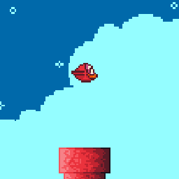

# Flap

A simple [Flappy Bird](https://en.wikipedia.org/wiki/Flappy_Bird) clone. Based on a [video tutorial](https://www.youtube.com/watch?v=1EFKe24X8vI) and modified using [Godot 4.1](https://godotengine.org/download/). Art assets courtesy of [Megacrash](https://megacrash.itch.io/flappy-bird-assets) ([CC0 license](https://creativecommons.org/publicdomain/zero/1.0/)).

## Controls

Press any key or mouse button for upward movement.
