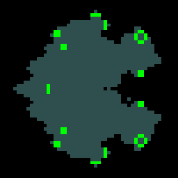

# Life

An implementation of [Conway's Game of Life](https://en.wikipedia.org/wiki/Conway%27s_Game_of_Life). Initially based on a [guide](https://gdscript.com/projects/game-of-life/), but significantly modified and improved using [Godot 4.2](https://godotengine.org/download/).

## Controls

Input | Effect
--- | ---
Left-click | Create cell.
Right-click | Delete cell.
Middle-click and drag | Move camera.
Scroll mouse wheel | Zoom in/out.
<kbd>Space</kbd> or <kbd>Enter</kbd> | Start/stop gameplay (i.e., automatic cell reproduction and death).
<kbd>Del</kbd> | Reset (delete all cells).
<kbd>Esc</kbd> | Stop, reset, or quit (depending on game state).
