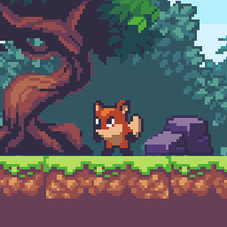

# Fox

A simple 2D [platformer](https://en.wikipedia.org/wiki/Platformer) game. Initially based on a [video tutorial](https://www.youtube.com/watch?v=S8lMTwSRoRg), but significantly modified and expanded using [Godot 4.2](https://godotengine.org/download/). Assets courtesy of [Ansimuz](https://ansimuz.itch.io/sunny-land-pixel-game-art).

## Controls

Move left/right via <kbd>←</kbd><kbd>→</kbd> and jump via <kbd>Space</kbd>.
