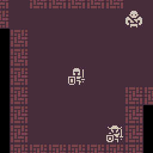

# Roguelike

A simple 2D fantasy [roguelike](https://en.wikipedia.org/wiki/Roguelike), built using [Godot 4.2](https://godotengine.org/download/) and initially based on a [tutorial](https://github.com/SelinaDev/Godot-Roguelike-Tutorial). Art assets courtesy of [Kenney's 1-Bit Pack](https://kenney.nl/assets/1-bit-pack) ([CC0 license](https://creativecommons.org/publicdomain/zero/1.0/)).

## Controls

Key | Action
--- | ---
<kbd>↑</kbd> <kbd>↓</kbd> <kbd>←</kbd> <kbd>→</kbd> (or numpad) | Move
<kbd>Del</kbd> or numpad <kbd>5</kbd> | Wait
<kbd><</kbd> / <kbd>></kbd> | Ascend/descend stairs
<kbd>G</kbd> | Get item
<kbd>D</kbd> | Drop item
<kbd>I</kbd> or <kbd>U</kbd> | Use item
<kbd>L</kbd> or <kbd>/</kbd> | Look
<kbd>V</kbd> or <kbd>H</kbd> | View message history
<kbd>Esc</kbd> | Exit current screen/menu/mode
<kbd>Ctrl</kbd>+<kbd>Q</kbd> | Quit
