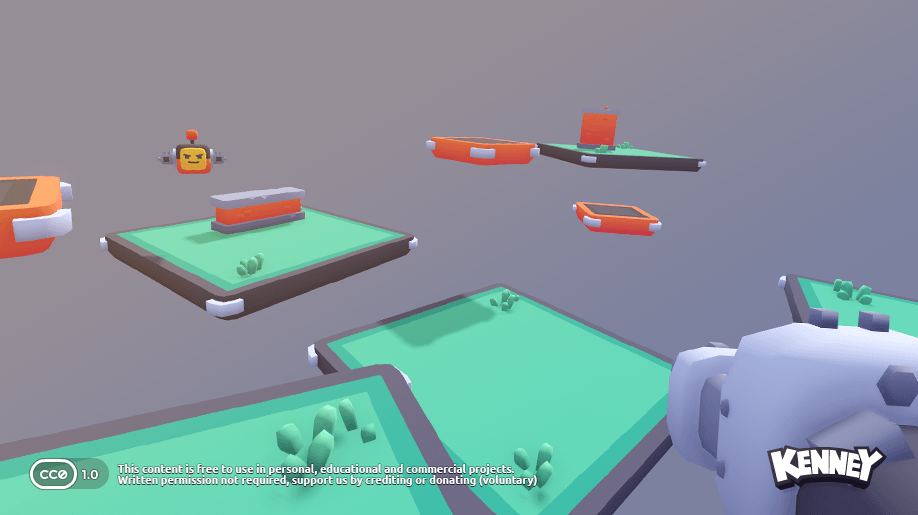

A simple [first-person shooter (FPS)](https://en.wikipedia.org/wiki/First-person_shooter), slightly modified from a [starter kit](https://github.com/KenneyNL/Starter-Kit-FPS) created by [Kenney](https://kenney.nl/).

### Controls

| Key | Command |
| --- | --- |
| <kbd>W</kbd> <kbd>A</kbd> <kbd>S</kbd> <kbd>D</kbd> | Movement |
| <kbd>space</kbd> | Jump |
| <kbd>left-click</kbd> | Shoot |
| <kbd>E</kbd> | Switch weapon |
