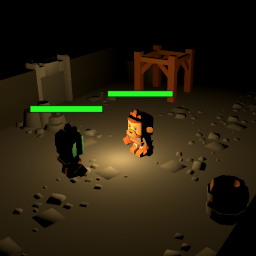

# 3D Roguelike

A simple 3D fantasy [roguelike](https://en.wikipedia.org/wiki/Roguelike), built using [Godot 4.2](https://godotengine.org/download/). Art assets courtesy of [Kenney's Mini Dungeon](https://www.kenney.nl/assets/mini-dungeon) ([CC0 license](https://creativecommons.org/publicdomain/zero/1.0/)).

## Controls

Key | Action
--- | ---
<kbd>W</kbd> <kbd>A</kbd> <kbd>S</kbd> <kbd>D</kbd> | Move (hold <kbd>Shift</kbd> to sprint)
<kbd>Space</kbd> | Jump
<kbd>Ctrl</kbd> | Attack (hold to repeat)
<kbd>E</kbd> | Interact (open doors/chests)
<kbd>↑</kbd> <kbd>↓</kbd> <kbd>←</kbd> <kbd>→</kbd> | Rotate camera
<kbd>+</kbd> / <kbd>-</kbd> | Zoom in/out
<kbd>Tab</kbd> | Switch between full zoom and previous zoom
<kbd>Esc</kbd> or <kbd>Ctrl</kbd>+<kbd>Q</kbd> | Quit
