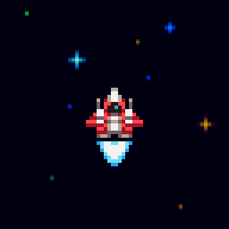
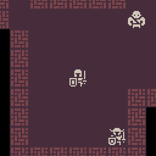
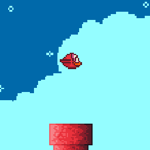
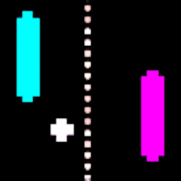
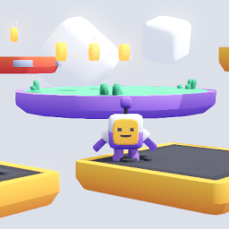
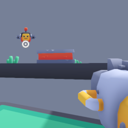

# godot-experiments

A repository for some of my experiments with [Godot](https://godotengine.org), the game engine we've all been [waiting for](https://en.wikipedia.org/wiki/Waiting_for_Godot)!

These practice projects include:

Game | Screenshot
--- | ---
[Fox](2d/platformer_fox), a simple 2D platformer. | 
Conway's Game of [Life](2d/life), a zero-player, Turing complete, cellular automaton. | 
[Shmup](2d/shmup), a 2D shoot 'em up. | 
[Roguelike](2d/roguelike), a 2D dungeon crawler. | 
[Flap](2d/flap), a _Flappy Bird_ clone. | 
[Pong](2d/pong), a two-player classic. | 
[3D Platformer](3d/platformer), a third-person coin-collection game. | 
[3D Roguelike](3d/roguelike), a simple third-person dungeon crawler. | 
[FPS](3d/fps), a simple first-person shooter. | 
