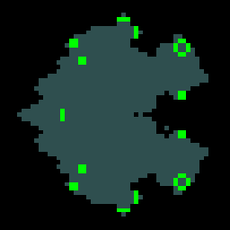

# godot-experiments

A repository for some of my experiments with [Godot](https://godotengine.org), the game engine we've all been [waiting for](https://en.wikipedia.org/wiki/Waiting_for_Godot)!

These practice projects include:

Game | Screenshot
--- | ---
[Fox](2d/platformer_fox), a simple 2D platformer.|
Conway's Game of [Life](2d/life), a zero-player, Turing complete, cellular automaton.|
[Shmup](2d/shmup), a 2D shoot 'em up.|
[Flap](2d/flap), a _Flappy Bird_ clone.|
[_Pong_](2d/pong), a two-player classic.|
[3D Platformer](3d/platformer), a third-person coin-collection game.|
[FPS](3d/fps), a simple first-person shooter.|
